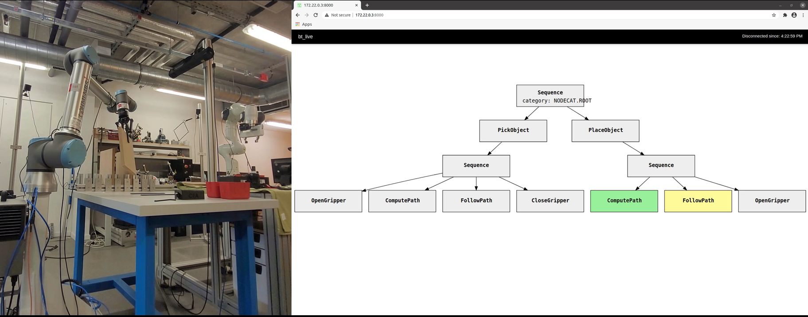

`MainTreeV0.xml` is the highest level BT that encodes the policy logics under test. It is a simple pick and place task done by a UR10e robot (`ur_ur10e`) that operates on one concrete instance of A50-type blocks in the assembly (`A50_1`). The block is moved from its original position to a predefined position in the kiln car (`right_side`).

The task is organized in two subtrees, `PickObject` and `PlaceObject`. The pick part is encoded as a simple sequence of five skills. The first four skills realize the actual pick task. First the robot opens the gripper. Then, it computes and follows the path to reach the target position (a grasp pose for block `A50_1`). Next, the robot closes its gripper (and hence grasps the object). Finally, the fifth skill (`AttachObject`) is used to update the virtual scene in the digital twin so that the grasped object can move together with the robot.

The place part is also encoded as a simple sequence, but of four skills. The first three skills realize the actual place task. First, the robot computes and follows the path to reach the new target position for block `A50_1`. The the block is released (gripper opened). Finally, the fourth skill (`DetachObject`) is used to update the virtual scene in the digital twin so that block `A50_1` does not move together with the robot anymore.

BTs `OpenGripper` and `CloseGripper` encode the policy logics of composite skills for opening and closing the robot gripper. Both skills are currently realized a simple sequences of one atomic skill that regulates the distance of gripper's fingers (`SetGripperDistance`).
